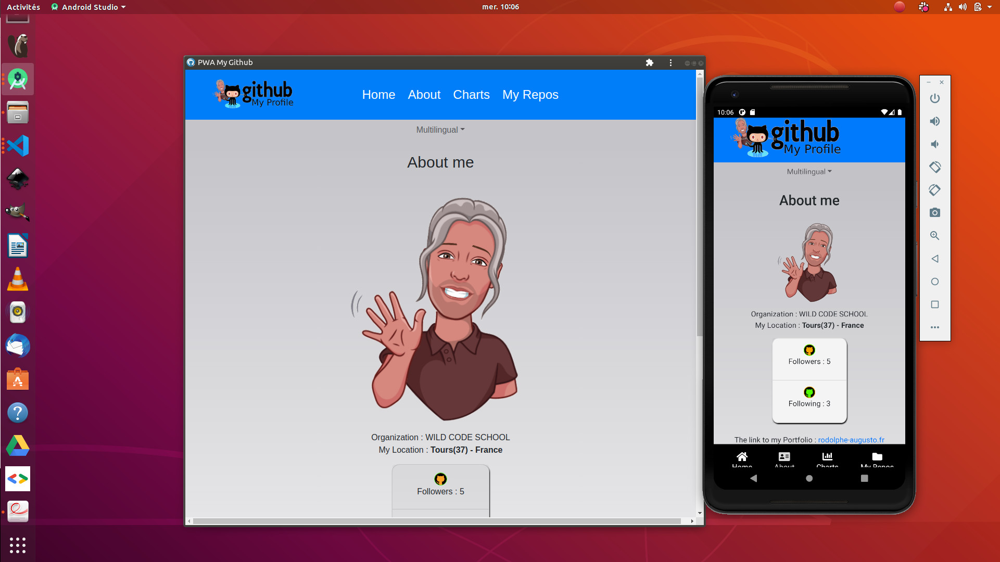
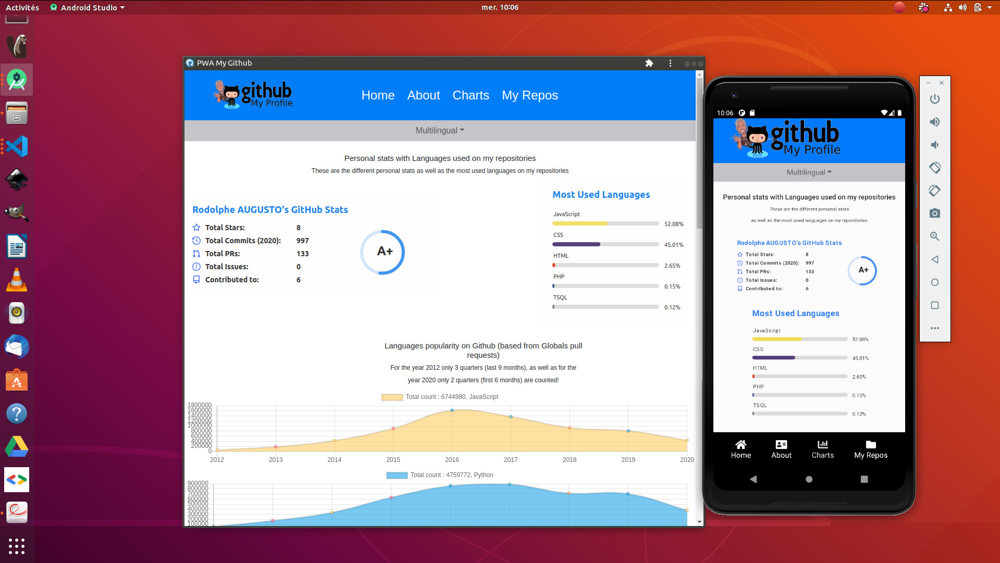
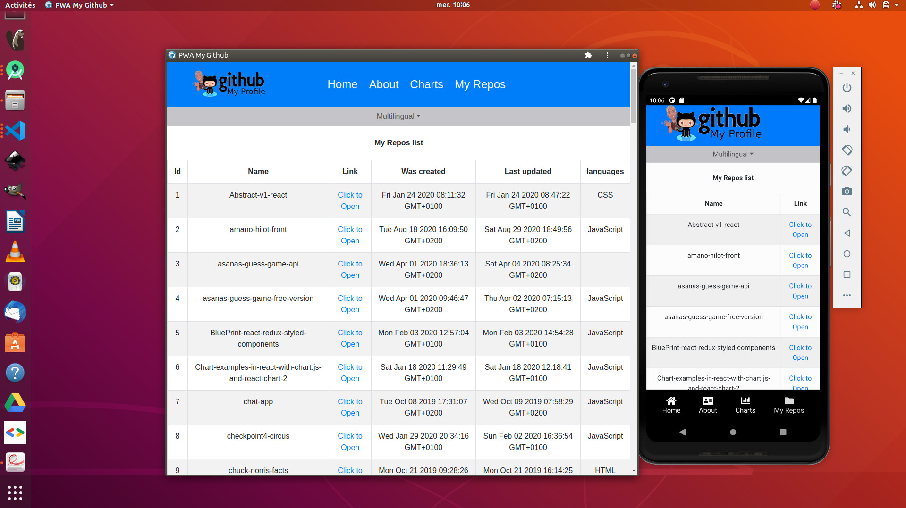
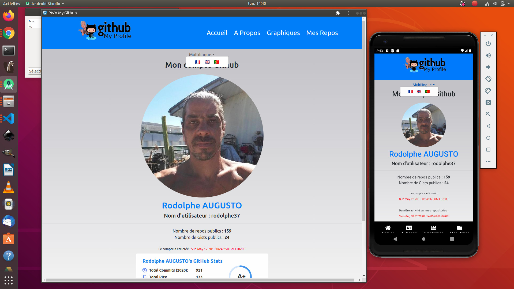
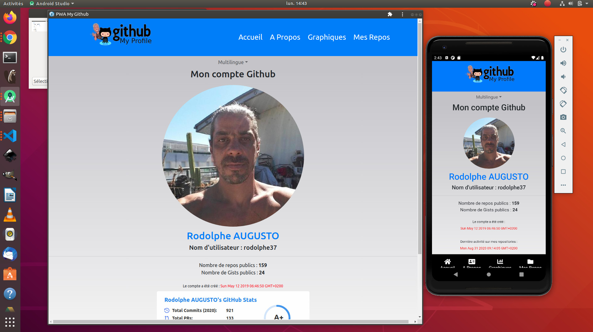
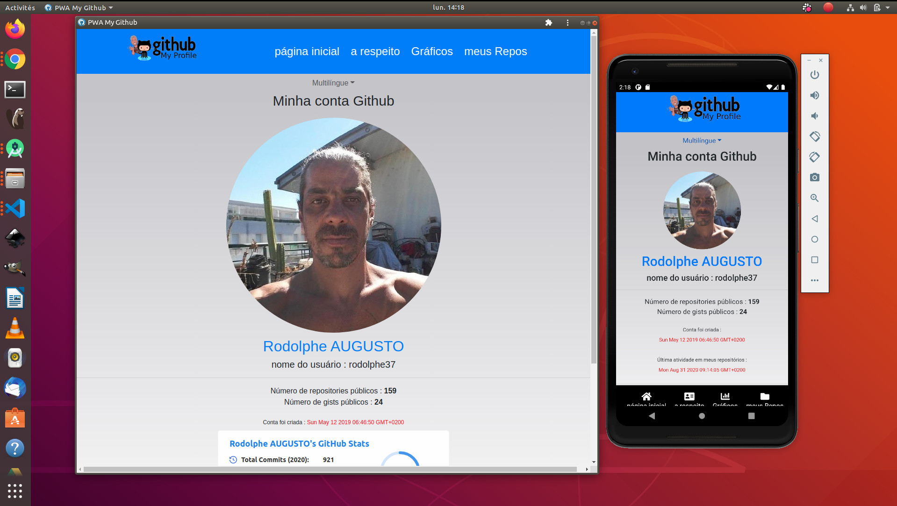

[](https://rodolphe-augusto.fr)
---
[](https://app.netlify.com/sites/my-github-pwa/deploys)

# My GitHub "open Sources" project

**Progressive Web App created with React.js**


***Github My Profile PWA***


---

### Application tested and verified under :

- Windows 10 professional edition

- Windows 7 family edition

- Mac osx Catalina

- Ubuntu 18.04 et 19.10

- Samsung Mobile phones (Note 9, A40, A51)
- Iphone 6 ,7, 8

---


## Quick Links

[Demo](#demo)

-  [LiveDemo](#live-demo)

-  [Movie](#movie-demo)

- [Pictures](#pictures-demo)

- [Offline](#offline-mode)


[Start Project](#start-project)


[Customization of the application](#customization-of-the-application)


[Author](#author)


[License](#license)

---

## Demo

---


### Live Demo

Link to the demo : https://my-github-pwa.netlify.app/


### Movie Demo


---

### Pictures Demo

**Home Page**


**About Page**


**Charts Page**


**Repositories List Page**


---

### Full Mutilingual support

**3 languages supported**


---

***French Version 🇨🇵***


***English Version 🇬🇧***


***Portuguese Version 🇵🇹***


---

### Offline Mode


---

## Tech Stack

**You must have at minimun these version for greats performances and good compatibility**


**Version of Node js**

- v10.22.0 minimun

---


## Start project

***Fork or clone directly this repository (or download, as well as you want):***

```bash

git clone https://github.com/rodolphe37/pwa-react-project


$ cd pwa-react-project


$ npm i or $ npm install

```

---


### Customization of the application

**Rename the env.local.example file at the root of application to .env.local only and put your own values** :smirk: :


```bash

#PROJECT OPEN SOURCE UNDER CREATIVE COMMONS LICENSE (CC BY-NC-SA) - CREATED BY RODOLPHE AUGUSTO

#For more info about this project, visit this address : https://github.com/rodolphe37/pwa-react-project
#or my portfolio at https://rodolphe-augusto.fr
#or contact me at rodolphe.a@gmail.com

#                                                                     ......
#                                                               .',:looddddooc,.'''...
#                                                            .':oxxkkO000Okxxkxodxxddol;'.
#                                                         .',:odxxddddxkxdddddxddxddxkOOko:'.
#                                                       'cddoodddddooddddddddddddddddxkOOkxdc'.
#                                                     .:dxxddoolooooooolllodddddoooooooddddxxo;.
#                                                    .ldxdooodxkOOOOOkkxxdolloloodxxxxdoooodddl;.
#                                                   .lddoodxk0OOkxxoolllooolcccloooodxkkkdooodool'
#                                                  .cddook000kxddolcllooollllllloollccloxkOkdlodxo'
#                                                  ,ldook0OkkdddoclodddxxdddddddddddoolccoxkOkolddc.
#                                                 .:oook0OkddddocldddxxdxxxxxxxxxxxxdddolcldxOOdldo,
#                                                 .;clx00kddddocldxxdxxxdxxdxxxxxddxxdxddocldxOOdlo:.
#                                                 .::ok0Oxddddllddxxxxxxxxxxddxxddxxxxxxddocldk0kolc.
#                                                 ':cokkkdddolldxdxxxxxdxxdxxxdddxxddxxxxxdlcoxOOol;.
#                                                .;c:lxkddolc:clllllooddxxxddxxddxxxdxxxxxdoclxOOoc,
#                                                .;loxxdlllllllllllllodxxxxdxxdlclloddxxxxxdclxOOo;.
#                                              .'cdkkdlloooooooooddxxdxxxxdxxdddolcccclodxxdllk0kl,.
#                                             .:dkkolloddlc::;;;:lodddodxdxdodxxxxxddolllodoldk0dc,
#                                            .cxkdc:ldxdoldxdc,.'colooloxxdolddddooooddddoollxOkl:.
#                                            ,dxdc::oxdddodxdlc:cdxodoodxxdlodoll:;;;:loddlldOOo:'
#                                           .;dxlc:cdxxxdddxxxddddddddddxxddddodl;'.;llcolldkOxc;.
#                                            'odlc:ldxxxxddxxxxxxxxxxxxxdxxxxdddolc:okdllloxOkl;;.
#                                            .cdoc;lxxxxxxxxxxxxdxxxxxxxdxxxxdxxxxddddoolldkOdc:,.
#                                             ,loc,lkxdxdxxxxxxxdooxxxxdxxxxxxddxxxxxxddlldxxoc;.
#                                             .coc;lkxxxxxxdddxxdlloodxxxxddodxxxdxxdxxdlldxoc:.
#                                             .:ol;lkxxxxxxxxxdddolllllllllcloxxxxxxxdxxoclddc,.
#                                             .;ol;lxxdxxxddddoooooollcclllloddxxxdxxdddoc:ldl:.
#                                             .;oc;cxddddoooooooooooooooooooooddxxxxxddoc;:clol,
#                                             .:lc;cddoooolcccoxkxdllllllloooooddxxddool;,',coo;.
#     ..                   ...                'cl:,cddoooooolcxKNWNX0kkOkkxdooooodxdolc:,. .:ol;.
#    ,,. ..       ....    .:oo;.             .;c;..:odoooooddoox0XXNWWMMWWXOlclloooolc;;.  .clc'
#   ':. .,.      .;odc'   .,lxo;.           .;;'.  ,cddooooooddoooddxkkOOkxdoooooolcc;,.  .:ll,.
#  .:' .,.       .,cdxl,.  .:oxo,.         .'..    .,codooooooddddoooooooodddoooollc;,.  ':lc,
#  .;. ,.         .,cdxo;. .,cdxl'                  .':odoooooooooooooodddoooooollc;'. .;cc;.
#  .,..,.    .'..  .,cdxdc. .;oxdc.          ...      .;coooooooooooooooooooooolc;,.  ':c;.
#  .;. ..   .:loc'. .,cdxxc..'cdxd:.       .;lol;.     .,;looooooooooooooooolc:;'.   ':;.
#   ''       .:odo:. .,cdxdc,':oxkd;.     .cdxxo;.     .;:;;;:clooooooooolc:;,,.    .;'
#    .        .;lddo:..':oxdc;;ldxxo;.   .,lxxo:.      'coolc:::::::::::;;;;::.     ''
#              ..:oddo:',coxdlclddxxd:.  .;lddl,      .,ldxdddddollccccllooll:'.    .
#                .,coxdl::oxddddxxdxxd:. .lxxdl.    ...,lxxxxdxxdxxxxxxxxxddoc'...
#                  .,codoodxddddxxddxxdc,;dkxdl'   ....;oxxdxddxxxxxxxxxxxxxdl,....
#          ',,'...  ..;odxxxxdloddlodxxdloxxxdc'.......cdxddxxddxxxxxxxxxxxddl;......
#         .;clollcc:;:coxdxdoccoxoclxxxdxxdxxd:........,lddddxxxxxxxxxxxxdddl;'.............
#           ..';:cloddddxdxdocldxxocoxxdxxxxddl,.......'.';lodxxdxxxxxxdddoc;'..''...............
#               ..',::codxdoodxxxdcldxxxxxxdo:.......''''.'',:cloodoolc;,''..'''''...'''''''''....
#                    ..;lodxddolodoldxxxxxxdc,.......'''''''....';cl:'.....''''''...'''''''''''''...
#                      .';codddooddddxxdddoc,........'''''.....'..,:,.'''....'''...'''''''''''''''...
#                     .....,:oddxddddddddo:...........''..............'''''....'...''''''''''''''''...
#                   ......'',:cllllodxxdc'.....................''...''''''''.....''''''''''''''''''...
#                  .....,cc;cllllloddxdl'....................''.....''''''''''''''''''''''''''''''''...
#                   ....,cc:ldxxxxxxxdxo,............................'''''''''''''''''''''''''''''''''..
#                    .',::codxxxxxxxdxo;............'''''''''..'''''.''''''''''''''''''''''''....''''''..
#                    .,;:ldxxxxxxxxxxdc'.........''''''''''''''''''''''''''''''''''''''''''''.....'''''...
#                  ..,;codxxxxxxxxxxdo;.........''''''''''''''''''''''''''''''''''''''''''''.......'''''..
#                 .',codxxdxxxxxxxxxdc'........'''''''''''''''''''''''''''''''''''''''''''''.........'''...
#                .,:odxxxxxxxxxdxxddo;.........''''''''''''''''''''''''''''''''''''''''''''................
#               .,cdxxxxxxxxxxxxxxddc'........'''''''''''''''''''''''''''''''''''''''''''''............''.
#               'coxxdxxxxxxxxxxxddo:.........''''''''''''''''''''''''''''''''''''''''''''......'',,;clol'
#              .,cdxxdxxxxxxxxxxddol;.........'''''''''''''''''''''''''''''''''''''''''''....,ccllooddxxo;.
#               ':odxxxxxxxxxxxddoo:'  ........'''''''''''''''''''''''''''''''''''''''''....'coooooddxxxd:.
#               .;codxxxxxxxxxddooc,.    ......''''''''''''''''''''''''''''''''''''''''.....;looooodxdolc,.
#                ':lodddxxxxdddolc;.      ......'''''''''''''''''''''''''''''''''''''......;cccccccc:;'..
#                .,:loooddddoolc:'.          ....'''''''''''''''''''''''''''''''''''................
#                 .,:looooolc:,..              ....''''''''''''''''''''''''''''''''.....
#                  .';:ccc:;'.                   ...'''''''''''''''''''''''''''''.....
#                     .  ..                        ....''''''''''''''''''''''''.....
#                                                    ....'''''''''''''''''''''...
#                                                      ..'..''''''''''.'''....
#                                                        ........''......


#Github My Profile APP (Progressive web app)
#FULL PERSONNALISATION OF THE APPLICATION HERE!!!

#first = remove (example) from this file name (it must be named only (.env.local)

#HOME PAGE & REPOSITORIES INFO

#enter your username github
REACT_APP_USERNAME=

#enter your picture profil url (without https://)
REACT_APP_PICTURE_USER=


#ABOUT PAGE

#Copy the link to your portfolio logo, or any other links picture in image hosting solutions like imgur or other (without https://)
REACT_APP_AVATAR_PICTURE=

#PORTFOLIO LINK

#enter your portfolio name only (Portfolio address is fetching direct form your github profil)
REACT_APP_PORTFOLIO_NAME=


#LANGUAGES & TOOLS SECTION

#enter images url of tools & languages you are used (without https://) (Only 8 images is enough, images 9 to 16 are optional )
REACT_APP_PICTURE_1=
REACT_APP_PICTURE_2=
REACT_APP_PICTURE_3=
REACT_APP_PICTURE_4=
REACT_APP_PICTURE_5=
REACT_APP_PICTURE_6=
REACT_APP_PICTURE_7=
REACT_APP_PICTURE_8=
REACT_APP_PICTURE_9=
REACT_APP_PICTURE_10=
REACT_APP_PICTURE_11=
REACT_APP_PICTURE_12=
REACT_APP_PICTURE_13=
REACT_APP_PICTURE_14=
REACT_APP_PICTURE_15=
REACT_APP_PICTURE_16=


#FOOTER

#Developer section footer

#enter your name link 1 here
REACT_APP_LINK1_NAME=
##enter your link 1 here (without https://)
REACT_APP_LINK1_URL=

#( if there is neither a link nor a pdf file, then it does not appear on the screen )
#enter your name link 2 (pdf file) CV for example here
REACT_APP_NAME_PDF=Cv

#enter your link 2 (without https://)
# (if empty then is take a pdf file (pdf-file.pdf) in ./src/assets/pdf folder by default)
REACT_APP_PDF_LINK=

#enter your name link 3 here
REACT_APP_LINK3_NAME=
#enter your link 3 here (without https://)
REACT_APP_LINK3_URL=

#enter your name link 4 here
REACT_APP_LINK4_NAME=
#enter your link 4 here (without https://)
REACT_APP_LINK4_URL=

#Illustrator section footer

#enter your store address 1 here (without https://)
REACT_APP_ADDRESS_STORE_1_URL=
#enter your store address 2 here (without https://)
REACT_APP_ADDRESS_STORE_2_URL=

#copyright section

#enter your name & the year for copyright
REACT_APP_NAME_COPYRIGHT=
REACT_APP_YEAR_COPYRIGHT=


# AND THAT'S ALL...
# ENJOY THE WORLD


```

**Last modification you can do!**

some texts must be modified in the translation files directly

**Explanation:**

***for "My Github bio" in about page***

- Go to "public/locales/" folder, the are 3 folders, one named "en" (for english texts), one named "fr" (for french texts) and another named "pt" (for Portugues texts)
The text you will must modifying is at the variable named "bioContent" at line  24

```bash

#file translation.json in each folder (en - fr - pt)
"bioContent": "Write your text here",

```

***for footer section (Developer & Illustrator)***

- You can change the name of the sections by going to the same files (translation.json) in each of the folders located in the "locales" folder.
The text you will must modifying is at they variables named "footerTitleDev" and "footerTitleIllustr" at line  8 and 9

```bash

#file translation.json in each folder (en - fr - pt)
"footerTitleDev": "Your name section 1 here",
"footerTitleIllustr": "Your name section 2 here",

```

- for changing the store names in illustrator section, the same files...
- The text you will must modifying is at they variables named "storeIllustr1" and "storeIllustr2" at line  10 and 11

```bash

#file translation.json in each folder (en - fr - pt)
"storeIllustr1": "Your store name 1",
"storeIllustr2": "Your store name 2",

```

And, now start a server

```bash

$ npm start

```

- and that's finish...
  enjoy!!!

---


## Author

- Thought, designed and developed with :purple_heart: by Rodolphe Augusto

---

## A few words from the author

Enjoy the World :smirk:

## Special thank's

Special thanks :

- to Anurag Hazra for "github personal stats widgets" :
https://github.com/anuraghazra/github-readme-stats

- to Anton Komarev for the "profile views counter" :
https://github.com/antonkomarev/github-profile-views-counter

- to Fabian Beuke for data from pull requests made on Github :
https://github.com/madnight/githut


## :sparkling_heart: Support the project

I put almost everything open-source I can, and try to accommodate anyone who needs help using these projects. Obviously,
this takes time. You can use this service for free.

However, if you are using this project and are happy with it or just want to encourage me to keep creating, there are a few ways to do it: -

- Give appropriate credit when using "Github My Profile App", with a link to My Github account or my portfolio address :D
- Put a star and share the project :rocket:

Thank you! :heart:


## License

Creative Commons


CC BY-NC-SA

**Attribution - No Commercial Use - Sharing under the Same Conditions**

[See the Explanatory Summary](https://creativecommons.org/licenses/by-nc-sa/4.0/) | [See the Legal Code](https://creativecommons.org/licenses/by-nc-sa/4.0/legalcode)

**This license allows others to remix, adapt, and build on your work for non-commercial purposes, as long as they credit you and license their new creations on the same terms.**

---
